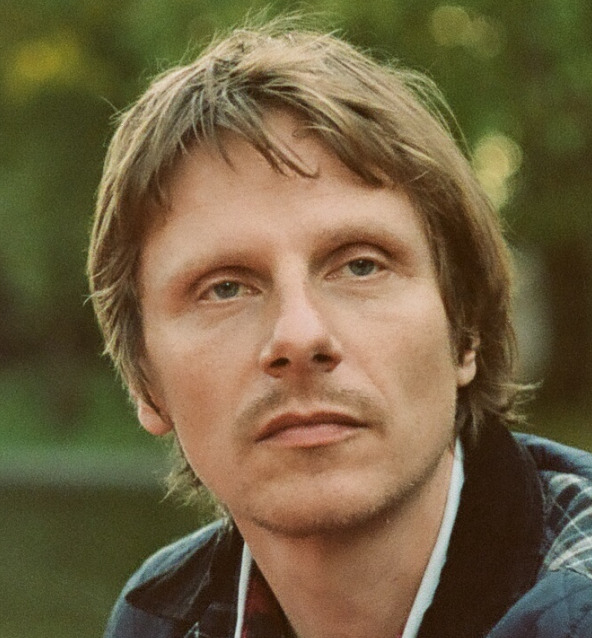
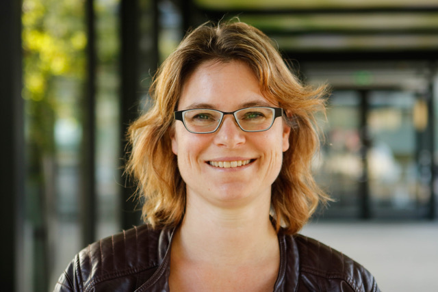

**Willem Zuidema** is associate professor of computational linguistics and cognitive science at ILLC (UvA), with a long term interest in the neural basis of language. Because of that cognitive interest, was early contributor to deep learning in NLP, with work on neural parsing published as early as 2008 (Borensztajn & Zuidema, 2008, CogSci), and pioneering contributions on tree-shaped neural networks, including the TreeLSTM (Le & Zuidema  <!--2015-->, \*SEM; published concurrently with groups from Stanford and Montreal). In 2016 he and his students introduced Diagnostic Classification  <!--(Veldhoen et al., 2016; Hupkes et al 2018; Giulianelli et al. 2018)-->, one of the key _interpretability_ techniques. He further performed research on the integration of formal logic and deep learning  <!--(Veldhoen & Zuidema, 2017; Repplinger, Beinborn & Zuidema, 2018; Mul & Zuidema, 2019)-->. Other directly relevant work focuses on other _interpretability techniques_ including Representational Similarity Analysis  <!--(Abnar et al., 2019)--> and contextual decomposition (Jumelet et al., 2019).

**Afra Alishahi** is an Associate Professor of Cognitive Science and Artificial Intelligence at Tilburg University. Her main research interests are developing computational models for studying the process of human language acquisition, studying the emergence of linguistic structure in grounded models of language learning, and developing tools and techniques for analyzing linguistic representations in neural models of language. She has received a number of research grants including an NWO Aspasia, an NWO Natural Artificial Intelligence and an e-Science Center/NWO grant. She is the co-organizer of the BlackboxNLP 2018 workshop, the first official venue dedicated to analyzing and interpreting neural networks for NLP. She has a number of well-received publications on the topic of interpretability of neural network models of language, including the recipient of the best paper award at the Conference on Computational Language Learning (CoNLL) in 2017.

**Grzegorz Chrupała** is an assistant professor at the Department of Cognitive Science and Artificial Intelligence at Tilburg University. His research focuses on computational models of language learning from multimodal signals such as speech and vision and on the analysis and interpretability of representations emerging in deep neural networks. He has served as area chair for ACL, EMNLP and CoNLL, and was general chair for Benelearn 2018. He co-organized the 2018 and 2019 editions of BlackboxNLP, the Workshop on Analyzing and Interpreting Neural Networks for NLP. Together with Afra Alishahi and students, he did some of the pioneering research on analyzing deep learning methods for visually grounded language <!--(Kádár, Chrupała and Alishahi 2017, CL)--> as well as for speech  <!--(Alishahi, Barking and Chrupała 2017, CoNLL)-->. In their most recent work in the area of analysis and interpretation Chrupała and Alishahi  <!--(2019, ACL)--> introduced methods based on Representational Similarity Analysis (RSA) and Tree Kernels (TK) which directly quantify how strongly information encoded in neural activation patterns corresponds to information represented by symbolic structures.

**Arianna Bisazza**
is an assistant professor at the Leiden Institute of Advanced Computer Science (LIACS) of Leiden University, fully funded by a VENI grant since 2016. Her research aims at identifying intrinsic limitations of current language modeling paradigms, and to design robust NLP algorithms that can adapt to a diverse range of linguistic phenomena observed among the world's languages. She has a long track record of contributions to machine translation for challenging language pairs 
<!--(Bisazza & Federico 2012; Tran, Bisazza & Monz, 2014; Fadaee, Bisazza & Monz, 2016)-->. Together with colleagues at the University of Amsterdam, she proposed the Recurrent Memory Network, one of the very first modifications to deep-learning based language models aimed at improving interpretability <!--(Tran, Bisazza & Monz, 2016)-->. Other recent contributions to the interpretability of NLP models include analyses of MT outputs <!--(Bentivogli et al., 2018)--> and probing tasks for recurrent language models <!--(Tran, Bisazza, and Monz, 2018; Bisazza & Tump, 2018)-->.

**Tom Lentz** is an assistant professor in computational phonology and cognitive science at the ILLC of the UvA.  He works on the detection of prosodic structure in speech, including automatic classification of pitch contours as gathered in controlled experiments. He has recently obtained an interdisciplinary research grant for a project on the detection of irony in spoken speech (funding for one PhD student). Relevant other experience is an investigation on the individual variation in the use of prosody to mark focus <!--(Lentz & Chen, 2015)-->.

**Louis ten Bosch** (RU, Nijmegen) has expertise in automatic speech recognition, _computational modelling of cognitive processes_, speech decoding techniques using phonological features, and structure discovery methods. He is one of the coorganizers of the successful DNN interpretation session “what we learn from DNNs” that took place in 2018 at the language and speech technology conference Interspeech in Hyderabad, India. One of the recent advances in understanding artificial networks is achieved by relating the mathematical layer-to-layer transformations in a network to the more structural description of datasets as shown by linear mixed effect models and by Generalized Additive Models. More recently, in collaboration with Mirjam Ernestus, he is involved in computational models of human spoken word comprehension, a number of abstract-versus-exemplar studies in psycholinguistics, and (with Ton Dijkstra) in computational modelling of  online sentence processing of idiomatic expressions.

**Iris Hendrickx** (RU, Nijmegen) is a researcher in computational linguistics and digital humanities with a focus on the areas of machine learning, lexical and relational semantics, natural language processing, techniques for document understanding and text mining. She provides expertise to the consortium on creating text data enriched with human annotation for training such models, and on applying and evaluating these models and augmenting them with domain expert knowledge.

**Antske Fokkens**
<!--is an assistant professor in computational linguistics at the Vrije Universiteit. Her main expertise lie in methodological questions in computational linguistics and, in particular, the importance of understanding the implications of chosen technologies, training data and features when applying computational language models in interdisciplinary contexts. She is a recognized international expert (with 16 funded international invitations) and has obtained multiple research grants, including a VENI grant in 2015 and co-applicantship of an NWO Vrije Competitie grant, as well as project funding from societal partners (leading up to a total of over 2.5M of research funds).-->

**Ashley Burgoyne**
<!--is the Lecturer in Computational Musicology at the University of Amsterdam and a member of the Music Cognition Group at the ILLC. With a background and cross-appointments in musicology and artificial intelligence, Burgoyne is interested in understanding musical behaviour at the audio level, using large-scale experiments and audio corpora. His McGill–Billboard corpus of time-aligned chord and structure transcriptions has served as a backbone for audio chord estimation techniques. His Hooked on Music project reached hundreds of thousands of participants in almost every country on Earth while collecting data to understand long-term musical memory. That data set will form the backbone of the musical subpackage in this grant.-->

## References


